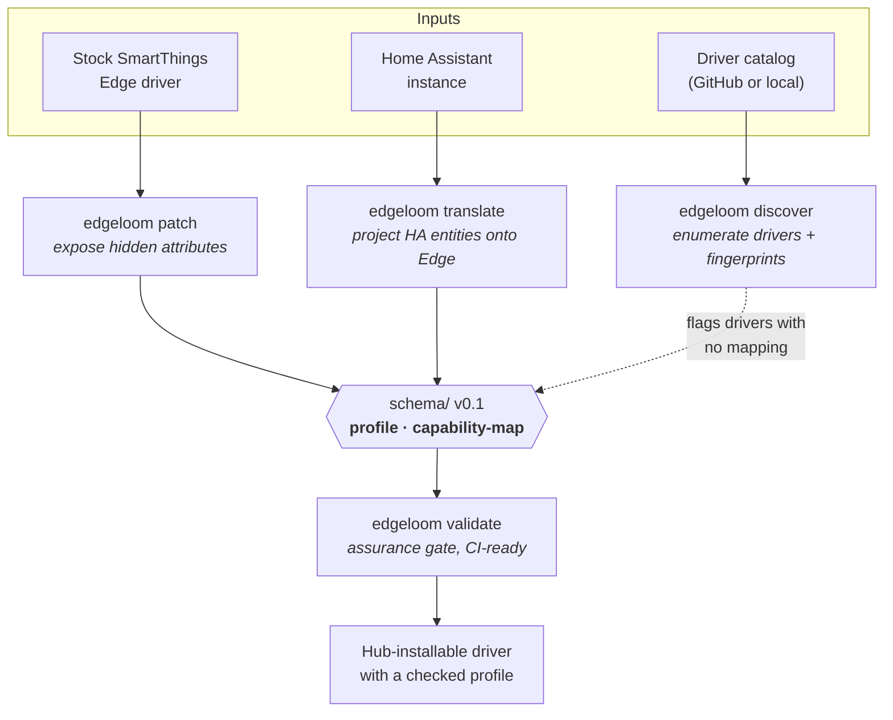

# EdgeLoom

[](https://github.com/edgeloom-oss/edgeloom/actions/workflows/ci.yml)
[](https://pypi.org/project/edgeloom/)
[](LICENSE)
[](pyproject.toml)

**An open toolchain for validating, patching, and translating smart-home edge
drivers across platforms.**

Smart-home hubs decide what a device is allowed to be. A lock that reports nine
configurable attributes over Zigbee may surface two of them, because the stock
driver's *profile* — the declared set of capabilities — never mentions the rest.
The device is not the limit; the driver is. EdgeLoom is the toolchain for
inspecting, rewriting, and checking those drivers.

The three tools do different jobs, but they all produce or consume the same
artifact: a device profile. EdgeLoom's position is that this artifact should be
a **checked contract** rather than a file each tool invents privately. So the
schema sits at the centre, and `edgeloom validate` is the gate everything passes
through.



Because both paths converge on one schema, a profile rewritten by the patcher
and a profile emitted by the translator are checked against identical rules —
which is what makes `validate` an assurance layer and not just a linter.

## Install

```bash
pip install edgeloom
```

From a checkout:

```bash
git clone https://github.com/edgeloom-oss/edgeloom.git
cd edgeloom
pip install -e ".[dev]"
```

Requires Python 3.11 or newer.

## Commands

```
edgeloom patch      DRIVER MODEL MANUFACTURER [ATTRIBUTES]  Expose hidden device attributes
edgeloom translate  --ha-url URL --output DIR               Bridge Home Assistant to SmartThings
edgeloom discover   [--source github|local]                 Enumerate drivers and fingerprints
edgeloom validate   [PATHS...]                              Check artifacts against the schema
```

Patch a Zigbee lock so its language and auto-relock settings become visible,
previewing first:

```bash
edgeloom patch auto_patch/zigbee-lock "YRD226 TSDB" Yale Language:AutoRelockTime --dry-run
edgeloom patch auto_patch/zigbee-lock "YRD226 TSDB" Yale Language:AutoRelockTime
```

The original driver is copied to `<driver>-backup` before anything is written,
and restored automatically if any step fails.

Generate SmartThings Edge proxy artifacts for your Home Assistant entities:

```bash
export HA_TOKEN=...   # a long-lived access token
edgeloom translate --ha-url http://homeassistant.local:8123 --output ./generated_edge
```

Check every profile and capability map in a tree:

```bash
edgeloom validate .
```

`validate` exits non-zero when a document violates the schema, and also when it
finds nothing to check — a silent pass over zero files would otherwise read as
success.

## Components

| Path | Component | Command | Documentation |
| --- | --- | --- | --- |
| `auto_patch/` | Edge driver patcher | `edgeloom patch` | [docs/patching.md](docs/patching.md) |
| `translator/` | Home Assistant bridge | `edgeloom translate` | [translator/README.md](translator/README.md) |
| `discovery/` | Driver catalog scanner | `edgeloom discover` | [docs/discovery.md](docs/discovery.md) |
| `schema/` | Published contracts | `edgeloom validate` | [schema/](schema/) |

The translator began life as
[HA2ST-Translator](https://github.com/edgeloom-oss/HA2ST-Translator), written by
Chuxiong Wu, and was merged here with its history intact. That repository is now
archived and redirects to this one.

## Schema

Version 0.1 publishes two JSON Schemas (draft 2020-12):

- **[`schema/profile.schema.json`](schema/profile.schema.json)** — a device
  profile: the capabilities a driver exposes for one device, and the categories
  describing it.
- **[`schema/capability-map.schema.json`](schema/capability-map.schema.json)** —
  which hidden attributes a driver may surface, and the capability each binds
  to. Capability IDs must be namespaced, so a vendor attribute cannot silently
  claim a standard identifier.

[`auto_patch/capability-map.yaml`](auto_patch/capability-map.yaml) is the live
map for the drivers shipped here, and is validated in CI on every push.

Both schemas are versioned and shipped inside the installed package, so
`edgeloom validate` works without a checkout.

## Development

```bash
make install   # dependencies
make lint      # ruff
make test      # pytest
```

CI runs lint, the full test suite, `edgeloom validate`, and shellcheck on every
push and pull request. See [docs/development.md](docs/development.md) for the
container workflow.

## Roadmap

The [project roadmap](ROADMAP.md) sequences two connected tracks: continued
hardening and expansion of the existing toolchain, and a federated evidence
catalog that links pinned platform artifacts, neutral SDF models, explicit
semantic-loss classifications, and human review. The next gate is a focused
restore-containment fix plus the bounded audit/evidence foundation; the catalog
begins with 3–5 reviewed SmartThings lock records rather than bulk ingestion.

Device reports from real hardware remain especially useful; see the
[device report template](.github/ISSUE_TEMPLATE/device_report.yml).

## Security

Please report vulnerabilities privately. See [SECURITY.md](SECURITY.md).

Patching a driver changes what a device exposes on your own hub. EdgeLoom is
pre-1.0 software: review a diff before installing anything on a hub you depend
on, and keep the backup it creates.

## How to Cite

If this project aids your research, cite the following work:

```bibtex
@inproceedings{xu2025hiddenattributes,
  title     = {Discovering and Exploiting IoT Device Hidden Attributes: A New Vulnerability in Smart Homes},
  author    = {Xuening Xu and Chenglong Fu and Xiaojiang Du and Bo Luo},
  booktitle = {Proceedings of the ACM Conference on Computer and Communications Security (CCS)},
  year      = {2025}
}
```

Machine-readable metadata is in [CITATION.cff](CITATION.cff).

## Contributing

Bug reports, device reports, and pull requests are welcome. Start with
[CONTRIBUTING.md](CONTRIBUTING.md) and the
[Code of Conduct](CODE_OF_CONDUCT.md). Changes are recorded in
[CHANGELOG.md](CHANGELOG.md).

Questions and design ideas belong in [GitHub Discussions](https://github.com/edgeloom-oss/edgeloom/discussions);
[SUPPORT.md](SUPPORT.md) routes bugs, device results, and private security
reports. Project decisions and responsibility are documented in
[GOVERNANCE.md](GOVERNANCE.md) and [MAINTAINERS.md](MAINTAINERS.md).

## License

Apache License 2.0 — see [LICENSE](LICENSE).
