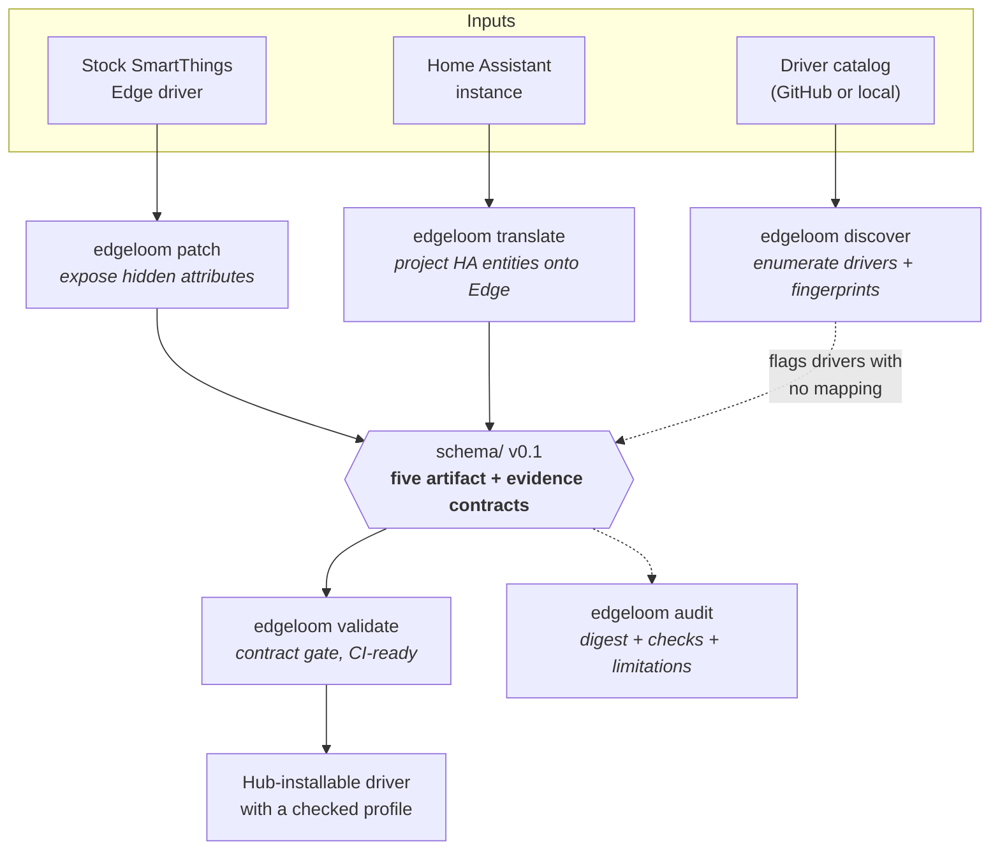

# EdgeLoom

[](https://github.com/edgeloom-oss/edgeloom/actions/workflows/ci.yml)
[](https://pypi.org/project/edgeloom/)
[](LICENSE)
[](pyproject.toml)

**An open toolchain for auditing, validating, patching, restoring, translating,
and discovering smart-home edge-driver artifacts.**

Smart-home hubs decide what a device is allowed to be. A lock that reports nine
configurable attributes over Zigbee may surface two of them, because the stock
driver's *profile* — the declared set of capabilities — never mentions the rest.
The device is not the limit; the driver is. EdgeLoom is the toolchain for
inspecting, rewriting, and checking those drivers.

The workflows do different jobs, but they all produce, consume, or inspect the
same artifacts: device profiles, capability mappings, and the evidence around
their transformation. EdgeLoom's position is that these artifacts should be
**checked contracts with reviewable evidence** rather than files each tool
interprets privately. The schemas sit at the centre; `edgeloom validate`
applies a contract and `edgeloom audit` records the exact local byte snapshot,
checks, authority labels, and limitations.


```mermaid
flowchart TD
    subgraph inputs [Inputs]
        A["Stock SmartThings<br/>Edge driver"]
        B["Home Assistant<br/>instance"]
        C["Driver catalog<br/>(GitHub or local)"]
    end

    A --> P["edgeloom patch<br/><i>expose hidden attributes</i>"]
    B --> T["edgeloom translate<br/><i>project HA entities onto Edge</i>"]
    C --> D["edgeloom discover<br/><i>enumerate drivers + fingerprints</i>"]

    P --> S
    T --> S
    D -.->|"flags drivers with<br/>no mapping"| S

    S{{"schema/ v0.1<br/><b>five artifact + evidence contracts</b>"}}

    S --> V["edgeloom validate<br/><i>contract gate, CI-ready</i>"]
    V --> O["Hub-installable driver<br/>with a checked profile"]
    S -.-> E["edgeloom audit<br/><i>digest + checks + limitations</i>"]
```

Because both transformation paths converge on one schema, a profile rewritten
by the patcher and a profile emitted by the translator are checked against
identical rules. Audit records add byte identity and check evidence without
claiming that structural validation proves provenance, semantic correctness,
security, or standards conformance.

## Install

```bash
pip install edgeloom
```

From a checkout:

```bash
git clone https://github.com/edgeloom-oss/edgeloom.git
cd edgeloom
pip install -e ".[dev]"
```

Requires Python 3.11 or newer.

## Commands

```
edgeloom patch      DRIVER MODEL MANUFACTURER [ATTRIBUTES]  Expose hidden device attributes
edgeloom restore    DRIVER                                 Restore a preserved pre-patch tree
edgeloom translate  --ha-url URL --output DIR               Bridge Home Assistant to SmartThings
edgeloom discover   [--source github|local]                 Enumerate drivers and fingerprints
edgeloom validate   [PATHS...]                              Check artifacts against the schema
edgeloom audit      ARTIFACT [--schema SCHEMA]              Create a local evidence record
```

Patch a Zigbee lock so its language and auto-relock settings become visible,
previewing first:

```bash
edgeloom patch auto_patch/zigbee-lock "YRD226 TSDB" Yale Language:AutoRelockTime --dry-run
edgeloom patch auto_patch/zigbee-lock "YRD226 TSDB" Yale Language:AutoRelockTime
```

The original driver is copied to `<driver>-backup` before anything is written,
and restored automatically if any step fails.

Restore the preserved tree explicitly when needed:

```bash
edgeloom restore auto_patch/zigbee-lock
```

Generate SmartThings Edge proxy artifacts for your Home Assistant entities:

```bash
export HA_TOKEN=...   # a long-lived access token
edgeloom translate --ha-url http://homeassistant.local:8123 --output ./generated_edge
```

Check every recognized toolchain or catalog contract in a tree:

```bash
edgeloom validate .
```

`validate` exits non-zero when a document violates the schema, and also when it
finds nothing to check — a silent pass over zero files would otherwise read as
success.

Create a reviewable local record for an artifact:

```bash
edgeloom audit model.sdf.json \
  --source-ref 0123456789abcdef \
  --artifact-status experimental \
  --output reports/model.evidence.json
```

The audit command hashes a local byte snapshot and records bounded syntax and
optional pinned-schema checks. Source URI, revision, license, maturity, and
schema authority are operator assertions: the command does not fetch or
authenticate them and is not a standards-conformance or certification tool.
See [Evidence records](docs/evidence-records.md).

### Device evidence catalog (development increment)

New `catalog check/fetch/build` commands and a draft device-navigation schema
are in this development tree, **not PyPI 0.2.0**. The companion catalog pins
the required core commit. Start with the
[five-minute, no-account walkthrough](docs/catalog-quickstart.md) or the
[catalog command and trust-boundary guide](docs/catalog.md).

```bash
edgeloom catalog check /path/to/edgeloom-catalog
edgeloom catalog build /path/to/edgeloom-catalog --output /path/to/new-view
```

Both commands are offline. Only the explicit `catalog fetch` downloads pinned
source bytes. Reports do not install drivers, infer patch availability, or
promote candidate mappings. Device entries, features, sources and mapping sets
remain separate from the existing driver discovery inventory.

### Device evidence bundles (draft preview)

A versioned bundle explains **why a feature is implemented that way**: it joins
official document references, pinned implementation records, scoped observations,
test plans and gaps. Contributors can add a source or observation before an SDF
mapping exists. The first candidate example follows Yale YRD210 battery behavior;
it does not claim a tested physical device or independent review.

See the [bundle draft and reproducible preview](docs/device-evidence-bundles.md)
for `bundle check/build/export/verify`. Packages contain catalog-authored records
and portable reports, not redistributed manuals or drivers. This draft is not
in PyPI 0.2.0; use the documented pinned installation.

## Components

| Path | Component | Command | Documentation |
| --- | --- | --- | --- |
| `auto_patch/` | Edge driver patcher | `edgeloom patch` | [docs/patching.md](docs/patching.md) |
| `translator/` | Home Assistant bridge | `edgeloom translate` | [translator/README.md](translator/README.md) |
| `discovery/` | Driver catalog scanner | `edgeloom discover` | [docs/discovery.md](docs/discovery.md) |
| `schema/` | Published contracts and evidence records | `edgeloom validate` | [schema/](schema/) |
| `edgeloom/evidence.py` | Local evidence recorder | `edgeloom audit` | [docs/evidence-records.md](docs/evidence-records.md) |

The translator began life as
[HA2ST-Translator](https://github.com/edgeloom-oss/HA2ST-Translator), written by
Chuxiong Wu, and was merged here with its history intact. That repository is now
archived and redirects to this one.

## Schema

Version 0.1 publishes five JSON Schemas (draft 2020-12):

- **[`schema/profile.schema.json`](schema/profile.schema.json)** — a device
  profile: the capabilities a driver exposes for one device, and the categories
  describing it.
- **[`schema/capability-map.schema.json`](schema/capability-map.schema.json)** —
  which hidden attributes a driver may surface, and the capability each binds
  to. Capability IDs must be namespaced, so a vendor attribute cannot silently
  claim a standard identifier.
- **[`schema/evidence-record.schema.json`](schema/evidence-record.schema.json)** —
  local artifact identity, deterministic checks, optional unauthenticated human
  disposition, and explicit limitations.
- **[`schema/source-manifest.schema.json`](schema/source-manifest.schema.json)** —
  an immutable upstream Git commit plus portable artifact paths, digests,
  parser-independent roles, explicitly bounded source maturity, and license
  evidence.
- **[`schema/catalog-mapping-set.schema.json`](schema/catalog-mapping-set.schema.json)** —
  evidence-backed mappings among device/protocol support, platform exposure,
  and neutral SDF representation, including loss and an unauthenticated review
  declaration whose authority comes from governed catalog history.

[`auto_patch/capability-map.yaml`](auto_patch/capability-map.yaml) is the live
map for the drivers shipped here, and is validated in CI on every push.

All five schemas are versioned and shipped inside the installed package, so
`edgeloom validate` and `edgeloom audit` work without a checkout.

See [Catalog Contracts](docs/catalog-contracts.md) for the mapping taxonomy,
status model, validation boundary, and synthetic lock example.

## Development

```bash
make install   # dependencies
make lint      # ruff
make test      # pytest
```

CI runs lint, the full test suite, `edgeloom validate`, and shellcheck on every
push and pull request. See [docs/development.md](docs/development.md) for the
container workflow. Maintainers should use the evidence-oriented
[release checklist](docs/releasing.md) before publishing a versioned package.

## Roadmap

The [project roadmap](ROADMAP.md) sequences two connected tracks: continued
hardening and expansion of the existing toolchain, and a federated evidence
catalog that links pinned platform artifacts, neutral SDF models, explicit
semantic-loss classifications, and human review. Restore containment, bounded
audit/evidence records, and the first catalog-contract slice are now on `main`.
The next gate is a 3–5-record SmartThings lock pilot with explicit licensing and
independent-review boundaries, rather than bulk ingestion. A separate
[`edgeloom-catalog`](https://github.com/edgeloom-oss/edgeloom-catalog)
contains a founder-seeded Yale YRD156 pilot: one device case, three mapping
sets, and six candidate assertions. None implies independent review or hardware
testing. Review branches make this evidence searchable and reproducible and
add a YRD210 Zigbee case with candidate-only HA/ZHA/Zigbee2MQTT
[external corroboration](docs/catalog-external-evidence.md), not borrowed
independent review or hardware validity;
see the [usable-device-evidence milestone](ROADMAP.md#current-construction-milestone--catalog-v01-usable-device-evidence).

Device reports from real hardware remain especially useful; see the
[device report template](.github/ISSUE_TEMPLATE/device_report.yml).

## Security

Please report vulnerabilities privately. See [SECURITY.md](SECURITY.md).

Patching a driver changes what a device exposes on your own hub. EdgeLoom is
pre-1.0 software: review a diff before installing anything on a hub you depend
on, and keep the backup it creates.

## How to Cite

If this project aids your research, cite the following work:

```bibtex
@inproceedings{xu2025hiddenattributes,
  title     = {Discovering and Exploiting IoT Device Hidden Attributes: A New Vulnerability in Smart Homes},
  author    = {Xuening Xu and Chenglong Fu and Xiaojiang Du and Bo Luo},
  booktitle = {Proceedings of the ACM Conference on Computer and Communications Security (CCS)},
  year      = {2025}
}
```

Machine-readable metadata is in [CITATION.cff](CITATION.cff).

## Contributing

Bug reports, device reports, and pull requests are welcome. Start with
[CONTRIBUTING.md](CONTRIBUTING.md) and the
[Code of Conduct](CODE_OF_CONDUCT.md). Changes are recorded in
[CHANGELOG.md](CHANGELOG.md).

Questions and design ideas belong in [GitHub Discussions](https://github.com/edgeloom-oss/edgeloom/discussions);
[SUPPORT.md](SUPPORT.md) routes bugs, device results, and private security
reports. Project decisions and responsibility are documented in
[GOVERNANCE.md](GOVERNANCE.md) and [MAINTAINERS.md](MAINTAINERS.md).

## License

Apache License 2.0 — see [LICENSE](LICENSE).
